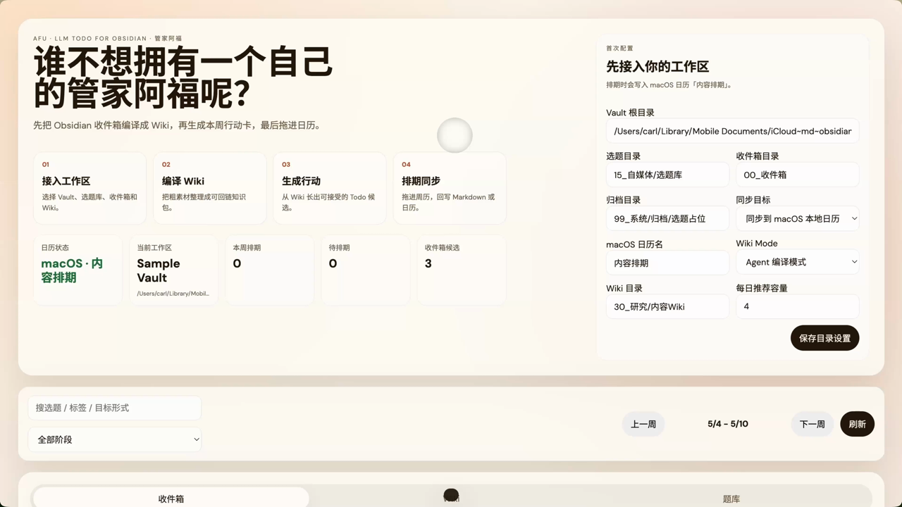

# 管家阿福 · Afu

**中文** | [English](README_EN.md)

> LLM Todo for Obsidian agents
>
> Inbox -> Wiki -> Todo Card -> Calendar

[](SKILL.md)
[](https://skills.sh/LearnPrompt/afu-llm-todo)
[](https://github.com/LearnPrompt/afu-llm-todo/releases)
[](LICENSE)


## 演示视频

[](https://github.com/LearnPrompt/afu-llm-todo/releases/download/demo-video-v1/afu-demo.mp4)

<sub>▲ 点击海报播放演示视频（GitHub README 不渲染外链 video 标签，所以用海报直链）</sub>

事情是这样的。

我自己的 Obsidian 里，收件箱经常不是没有东西，是东西太多了。网页、帖子、论文、灵感、项目记录，全都在里面。真要开始做事的时候，反而会卡住。

普通 Todo 只能催你一声，告诉你还有一件事没做。

但很多时候，真正难的不是执行，是先从一堆材料里判断，哪几件事值得进入这周。

所以才有了管家阿福。

它不是来替代 Obsidian 的，也不是又一个任务管理器。它更像站在 Vault 门口的管家，先把收件箱里的材料整理成 Wiki，再把 Wiki 里已经长出来的判断，变成可以排进日历的待办卡。

```text
Inbox -> Wiki -> Todo Card -> Calendar
```

## 安装给 Agent 用

如果你的 Agent 支持 Skill 安装，优先用这个方式：

```bash
npx skills add LearnPrompt/afu-llm-todo
```

安装后，把需求直接交给 Agent：

```text
用管家阿福整理我的 Obsidian 收件箱，先编译 Wiki，再给我生成这周的待办卡。
```

## 触发方式

装完之后,这些话都能唤醒阿福:

- "整理我的 Obsidian 收件箱"
- "把 inbox 这批资料编译成 Wiki"
- "从 Wiki 给我生成这周的待办卡"
- "把待办卡排进周历"
- 甚至只是:"我的 Obsidian 堆了一堆没处理的东西"

它不会接的活(免得抢错戏):非 Obsidian 的普通待办清单、改写润色你的笔记原文、Notion 类非 Markdown 知识库。

## 想先看 UI

Demo 跑在 sample vault 里，你自己的笔记先原地不动。

```bash
git clone https://github.com/LearnPrompt/afu-llm-todo.git
cd afu-llm-todo
npm install
npm run demo:reset
npm run demo
```

打开：

```bash
open http://localhost:4317
```

你会看到三条 sample 素材。把它们送进 Wiki，生成待办卡，再拖进周排期。

## 不需要跟我一模一样的 Vault，你可以随便改

默认 sample vault 用的是这几个目录：

```text
00_收件箱
30_研究/内容Wiki
15_自媒体/选题库
```

但这只是示例。

你自己的 Vault 可以叫别的名字。阿福真正需要知道的只有三个位置：

- 粗素材在哪里
- Wiki 写到哪里
- 待办卡写到哪里

剩下的路径，都可以在配置里改。Markdown 还在你的本地，阿福只是帮 Agent 找到入口和写回位置。

## 工作原理

阿福不是直接把收件箱里的每条东西都变成任务。

它先做一次中间整理。

```text
Inbox
  -> Wiki packet
  -> Markdown Wiki
  -> Todo Card
  -> Calendar
```

这一步很关键。

因为收件箱里的东西通常是乱的。一个链接里可能只有半个观点，一段摘录里可能只有一个线索，一个项目记录里可能藏着真正要做的下一步。

阿福会先把这些材料放进 Wiki 语境里，让 Agent 有地方沉淀判断。等 Wiki 里已经能看出方向了，再生成待办卡。

所以它不是在帮你多列几个任务。

它是在帮你把资料变成能动起来的东西。

## 安全边界

阿福是管家,不是主人:

- **收件箱原文永不改写**——它只移动、归档、编译,不动你写的字;
- **只写三类位置**:Wiki 目录、待办卡目录、操作日志;不碰 vault 里其他任何文件;
- **每一步落日志**:导入、排期、作废、Wiki 编译都有记录,出错可以照日志回滚;
- **写入前确认**:待办卡入库需要你点头,不会先斩后奏;
- **本地优先**:Markdown 是唯一真源,不引入外部数据库,第一版不强制外部 LLM API Key。

## 背后故事

这个项目一开始不是为了发布。

它只是我自己在 Obsidian 前面补的一层小工具。因为我真的经常遇到一个问题，收件箱里明明有很多好东西，但每次要排这一周的时候，还是得从头翻一遍。

翻着翻着就累了。

后来 Karpathy 提到 LLM Wiki，我一下子觉得这个方向很对。资料不应该永远躺在收件箱里，也不应该每次都靠临时搜索重新理解一遍。更好的方式，是让 Agent 把它们整理成一个会生长的 Wiki。

参考：<https://gist.github.com/karpathy/442a6bf555914893e9891c11519de94f>

再往前走一步，Wiki 不应该只是被查询。

它应该长出行动。

这就是 Afu。

---

<div align="center">

**[LearnPrompt](https://github.com/LearnPrompt) 出品** · 同门手艺

[鲁班·Skill打磨](https://github.com/LearnPrompt/luban-skill) · [庖丁·博主蒸馏](https://github.com/LearnPrompt/paoding-skill) · [蔡伦·对话造纸](https://github.com/LearnPrompt/cailun-skill) · [阿福·LLM Todo](https://github.com/LearnPrompt/afu-llm-todo) · [AI雷达·零API资讯](https://github.com/LearnPrompt/ai-news-radar) · [淘金小镇·ClawHub日榜](https://github.com/LearnPrompt/skillrush-town) · [Irasutoya·正文配图](https://github.com/LearnPrompt/carl-irasutoya-illustrations) · [Humanize PPT·简报编排](https://github.com/LearnPrompt/humanize-ppt) · [CC Harness·六件套](https://github.com/LearnPrompt/cc-harness-skills)

<sub>公众号「卡尔的AI沃茨」 · [X @aiwarts](https://x.com/aiwarts) · [learnprompt.pro](https://www.learnprompt.pro)</sub>

</div>
