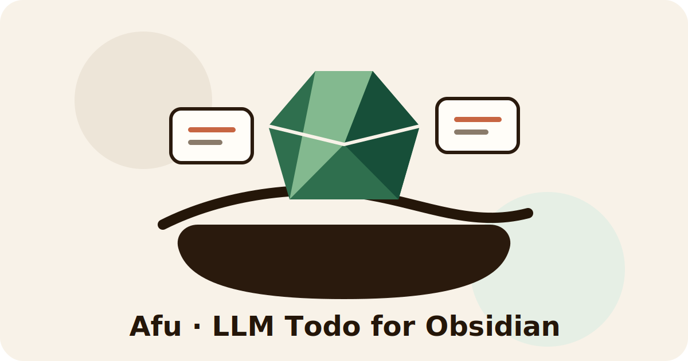
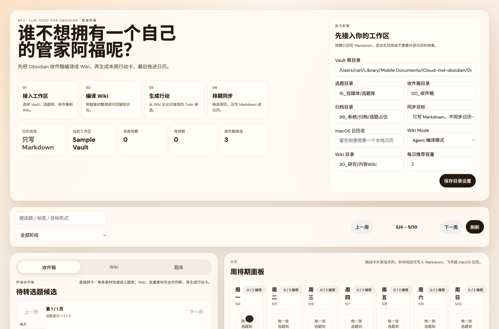

# 管家阿福 · Afu

> **LLM Todo for Obsidian**
>
> Turn your Obsidian inbox into a living wiki, then into this week's todo list.



## Demo Video

10 秒演示视频会放在这里。现在先用当前 demo 截图占位，等视频上传后替换为 `docs/assets/afu-demo-10s.mp4`。



你不需要又一个 Todo App。你需要一个管家阿福。

他不抢主角戏，不替你写人生规划，也不把你的 Obsidian 搬去另一个数据库。阿福站在 Vault 前面，把收件箱里的网页、帖子、论文、灵感和碎片先整理成 LLM Wiki，再安排成本周能执行的行动卡和日历。

中文小说里总有那种无所不能的管家；超级英雄故事里，也总有一个人默默把装备、情报、行程和退路都准备好。**管家阿福就是这个角色，但服务对象是你的 Obsidian 和内容生产。**

```text
00_收件箱 -> LLM Wiki -> Todo / 选题卡 -> 周排期 -> Markdown / 飞书 / macOS 日历
```

---

## 为什么会有阿福

Obsidian 很适合长期积累，但收件箱很容易变成“以后再看”的坟场。

普通 Todo 只能提醒你“做什么”；内容创作者真正缺的是前一步：**从混乱素材里判断什么值得做，为什么现在做，以及排到哪一天做。**

阿福的工作不是替代 Obsidian，而是补上 Obsidian 前面的内容运营层：

- 把 `00_收件箱` 的粗素材转成可处理批次
- 把一批素材编译成可回链的内容 Wiki
- 从 Wiki 里生成本周可接受/拒绝的行动卡
- 把行动卡变成 Obsidian 选题卡
- 拖到周历后写回 Markdown，并可选同步飞书或 macOS 日历

---

## 60 秒 Demo

```bash
npm run demo:reset
npm run demo
```

然后打开：

```bash
open http://localhost:4317
```

Demo 使用 `examples/sample-vault/`，不会碰你的真实 Vault。

演示流程：

1. 在 `收件箱` 看 3 条粗素材。
2. 加入 `Wiki` 批次，生成行动卡。
3. 接受行动卡进入 `题库`。
4. 把卡片拖进 `周排期`，选择快捷时间段。
5. 写回 Markdown，或同步到飞书 / macOS 日历。

完整录屏脚本见 [docs/launch/demo-script.md](docs/launch/demo-script.md)。

---

## LLM Wiki，不是又一个 RAG 壳

阿福的 Wiki Mode 受到 Karpathy 的 LLM Wiki 思路启发：不要只在查询时临时检索一堆原文，而是让 LLM / Agent 把资料维护成一个持久、可读、可回链的 Markdown Wiki。

参考：<https://gist.github.com/karpathy/442a6bf555914893e9891c11519de94f>

阿福把这个想法落到内容排期里：

```text
收件箱素材
  -> Wiki ingest packet
  -> 30_研究/内容Wiki
  -> candidate todos
  -> 15_自媒体/选题库
  -> 周排期
```

第一版不直接调用外部 LLM API，不要求 API Key。应用生成结构化 Markdown packet，Codex、Claude 或你自己的本地 Agent 可以继续编译和写回。这样保留了本地优先，也更容易被不同人的 Vault 结构迁移。

---

## 两种模式

### Planner Mode

适合日常快速排期：

```text
00_收件箱 -> 选题卡 -> 周排期 -> Markdown / 飞书 / macOS 日历
```

你可以直接把单条素材转成选题卡，拖进日历，然后补开始/结束时间。

### Wiki Mode

适合批量素材判断：

```text
00_收件箱 -> 内容 Wiki -> 行动卡 -> 选题卡 -> 周排期
```

一批素材先合并判断，再长出更少、更有依据的行动卡。适合处理几百条收件箱、热点跟踪、研究型选题和系列内容。

---

## 适合谁

- 公众号、视频号、Newsletter、播客、课程、研究型内容创作者
- 每天把网页、帖子、论文、产品发布丢进 Obsidian 的人
- 想要 LLM Wiki，但不想把知识库迁移到外部数据库的人
- 已经用 Git、iCloud、Time Machine 管理 Markdown 的本地优先用户
- 想把“素材判断”和“本周排期”连起来的人

不适合第一版：

- 泛 Todo 管理
- 团队协作看板
- 云端多端同步服务
- 替代 Obsidian 的知识库产品
- 强依赖外部 LLM API 的自动化流水线

---

## 为什么不是 Notion / Trello / 普通 Todo

Notion 和 Trello 更像数据库或看板。普通 Todo 更像任务列表。阿福的中心不是“任务管理”，而是：

> 让收件箱素材先变成可回链的 Wiki，再从 Wiki 里长出本周应该做的内容行动。

任务不是凭空出现的。对内容创作者来说，任务来自素材、判断、上下文和时机。阿福把这几件事串起来。

---

## 本地优先

所有核心数据都写回你的 Vault：

- 收件箱素材：`00_收件箱/**/*.md`
- 选题卡：`15_自媒体/选题库/*.md`
- Wiki 页面：`30_研究/内容Wiki/**/*.md`
- 操作日志：`99_系统/topic-planner-log/YYYY-MM-DD.md`
- 作废归档：`99_系统/归档/选题占位`

这意味着：

- Markdown 是唯一真源
- 不需要外部数据库
- 可用 Git / iCloud / Time Machine 回滚
- 可以迁移到任意 Obsidian Vault
- 收件箱原文正文不会被改写

---

## 日历目标

支持三种同步目标：

- `只写 Markdown`：适合试用或不需要外部日历的场景
- `同步到 macOS 本地日历`：适合个人本地排期
- `同步到飞书日历`：适合已经在飞书里看日程的人

排期弹窗支持快捷时段：

```json
[
  { "label": "上午深度", "start": "09:30", "end": "11:00" },
  { "label": "下午制作", "start": "14:00", "end": "15:30" },
  { "label": "晚上发布", "start": "20:00", "end": "20:30" }
]
```

飞书创建日程使用：

```bash
lark-cli calendar events create --params '<JSON>' --data '<JSON>'
```

不要使用旧的 `--calendar-id` 参数。

---

## 安装与命令

```bash
npm install
npm run demo:reset
npm run demo
```

常用命令：

```bash
npm run dev
npm run demo
npm run demo:reset
npm run verify
npm test
```

生成 Wiki packet：

```bash
bash scripts/wiki-compile-packet.sh
```

---

## Sample Vault

`npm run demo:reset` 会重置：

- `examples/sample-vault/00_收件箱`
- `examples/sample-vault/15_自媒体/选题库`
- `examples/sample-vault/30_研究/内容Wiki`
- `examples/sample-vault/99_系统/归档/选题占位`

验证示例库：

```bash
TOPIC_PLANNER_VAULT_ROOT="$PWD/examples/sample-vault" \
TOPIC_PLANNER_CONFIG="$PWD/examples/sample-vault/topic-planner.config.json" \
npm run verify
```

---

## 配置

配置文件：

- `topic-planner.config.json`
- 示例：`topic-planner.config.json.example`

关键字段：

```json
{
  "vaultRoot": "/Users/yourname/ObsidianVault",
  "topicDir": "15_自媒体/选题库",
  "inboxDir": "00_收件箱",
  "archiveDir": "99_系统/归档/选题占位",
  "wikiMode": "agent",
  "wikiDir": "30_研究/内容Wiki",
  "wikiIndexPath": "30_研究/内容Wiki/index.md",
  "wikiLogPath": "30_研究/内容Wiki/log.md",
  "dailyCapacity": 2,
  "calendarProvider": "none",
  "macosCalendarName": ""
}
```

`wikiMode` 可选：

- `off`：关闭 Wiki Mode
- `agent`：生成 Wiki packet 和 Todo 候选，由 Agent 继续处理

---

## API

核心：

- `GET /api/topics`
- `POST /api/topics/schedule`
- `POST /api/topics/unschedule`
- `POST /api/topics/disposition`
- `GET /api/diagnostics`
- `GET /api/health`

收件箱：

- `GET /api/inbox-candidates`
- `POST /api/inbox/import`
- `POST /api/inbox/import-batch`

Wiki Mode：

- `POST /api/wiki/compile`
- `POST /api/wiki/todos/generate`
- `POST /api/wiki/todos/accept`
- `POST /api/wiki/todos/reject`

设置：

- `GET /api/settings`
- `POST /api/settings`

---

## 发布素材

- ClawHub 文案：[docs/launch/clawhub.md](docs/launch/clawhub.md)
- 社媒文案：[docs/launch/social.md](docs/launch/social.md)
- 60 秒录屏脚本：[docs/launch/demo-script.md](docs/launch/demo-script.md)
- 视觉方向：[docs/assets/brand-directions.md](docs/assets/brand-directions.md)

---

## 致谢与边界

阿福借鉴了 LLM Wiki 的资料编译思路，也借用了“全能管家”这个文化梗作为产品人格。但它不是 Obsidian、Karpathy、Batman 或任何外部 IP 的官方项目，也不使用这些品牌或人物的肖像背书。

阿福只是一个站在 Obsidian 前面的本地内容管家：帮你把素材、Wiki、选题和日历收拾妥当。
